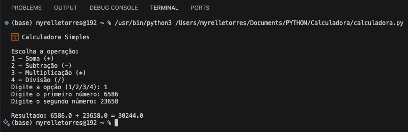

# 🧮 Calculadora Simples em Python

Uma calculadora básica feita em Python para praticar programação iniciante.  
Permite realizar as quatro operações matemáticas: **soma, subtração, multiplicação e divisão**.

---

## 🚀 Como executar

1. Clone este repositório ou baixe os arquivos.
2. Abra o projeto no VS Code.
3. No terminal, execute:

```bash
python calculadora.py

```
✅ Funcionalidades

Soma (+)

Subtração (-)

Multiplicação (*)

Divisão (/) com tratamento de erro para divisão por zero


🖥️ Exemplo de execução

Aqui está um exemplo de uso no terminal:



📚 Aprendizados
Pratiquei funções básicas em Python.
Uso de condições (if/else).
Tratamento de erro de divisão por zero.
Uso de try/except para capturar erros de entrada inválida.

📜 Licença
Este projeto é open-source e pode ser usado livremente para estudos. 😉
Feito por Myrelle Torres.

⚙️ Tecnologias utilizadas
Python 3.9
